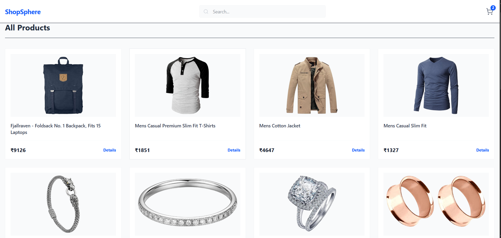
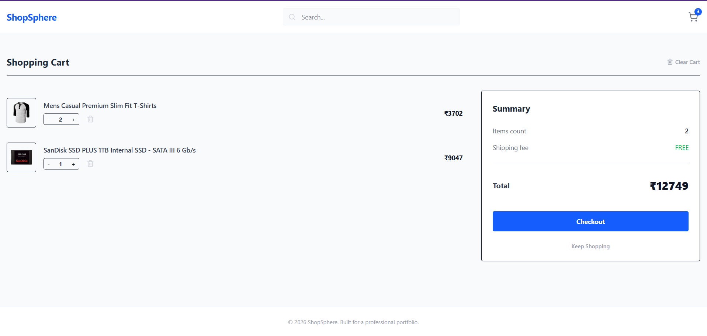
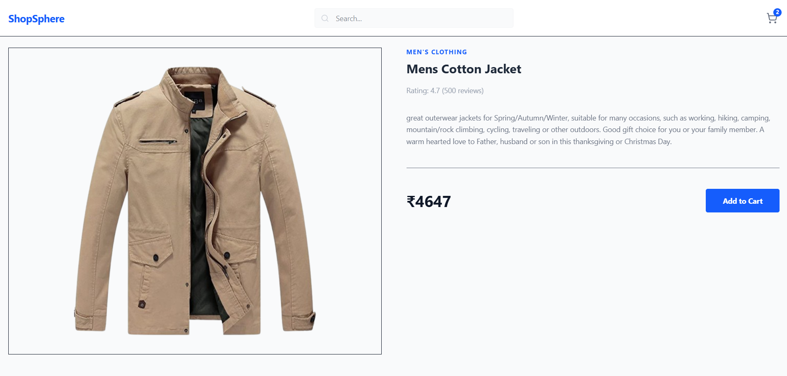

# 🛒 ShopSphere - Modern E-commerce Web App


---

## 📌 Overview

**ShopSphere** is a clean and minimal e-commerce frontend built to demonstrate real-world React concepts like state management, component architecture, and reusable logic.

---

## ✨ Features

* 🔍 Product listing with API integration
* 🛒 Add to cart, remove items, and update quantity
* 💾 Cart persistence using localStorage
* 💰 Price conversion from USD to INR (₹)
* 🔎 Case-insensitive search functionality
* 📱 Fully responsive design

---

## 🛠️ Tech Stack

* **Frontend:** React.js (Functional Components & Hooks)
* **Styling:** Tailwind CSS
* **State Management:** Context API + useReducer
* **Routing:** React Router DOM
* **Language:** JavaScript (ES6+)

---

## 📂 Project Structure

```
src/
 ├── components/
 ├── pages/
 ├── context/
 ├── utils/
 ├── App.jsx
 ├── main.jsx
 └── index.css
```

---

## 🧠 Key Highlights

* ✔ Separation of concerns (UI and logic handled separately)
* ✔ Predictable state management using useReducer
* ✔ Reusable utility functions for better scalability
* ✔ Clean and maintainable code structure

---

## 🌐 Live Demo

👉 https://your-vercel-link.vercel.app

---

## 📸 Screenshots

### 🏠 Home Page



### 🛒 Cart Page



### 📦 Product Detail



---

## 🚀 Getting Started

1. Install dependencies:

```bash
npm install
```

2. Start development server:

```bash
npm run dev
```

3. Build for production:

```bash
npm run build
```

---

## 👨‍💻 Author

**Rohit Maddheshiya**
CS Student | Full-Stack Developer

---

## ⭐ Support

If you like this project, consider giving it a ⭐ on GitHub!
